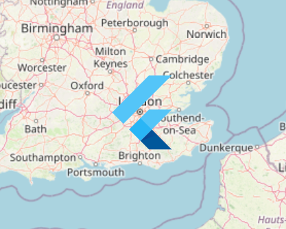

# Marker Layer

You can add single point features - such as pins, labels, or markers - to maps using `MarkerLayer` and `Marker`s.


No more image only markers! [Unlike _other_ ](https://github.com/flutter/flutter/issues/24213)😉[^1][ popular mapping libraries](https://github.com/flutter/flutter/issues/24213), we allow usage of any widget as the marker.






<figure><figcaption><p>An example <code>Marker</code>, using <code>FlutterLogo</code> as the child</p></figcaption></figure>

```dart
MarkerLayer(
  markers: [
    Marker(
      point: LatLng(30, 40),
      width: 80,
      height: 80,
      builder: (context) => FlutterLogo(),
    ),
  ],
),
```


Excessive use of markers may create performance issues.

Consider using a clustering plugin to merge nearby markers together, reducing the work that needs to be done when rendering: [#marker-clustering](../plugins/list.md#marker-clustering "mention").


## Handling Gestures

There is no built-in support to handle gestures on `Marker`s, such as taps. However, this is easy to implement using a standard `GestureDetector`.

## Rotation

It is possible to enable the `Marker` to automatically counter-rotate to the camera's rotation, to ensure it remains facing upwards, via the `rotate` argument.

There is no built-in support to rotate markers to a specific degree. However, this is easy to implement through a rotating widget, such as `Transform.rotate`.

[^1]: [Google Maps \*wink \*wink](https://github.com/flutter/flutter/issues/24213)
